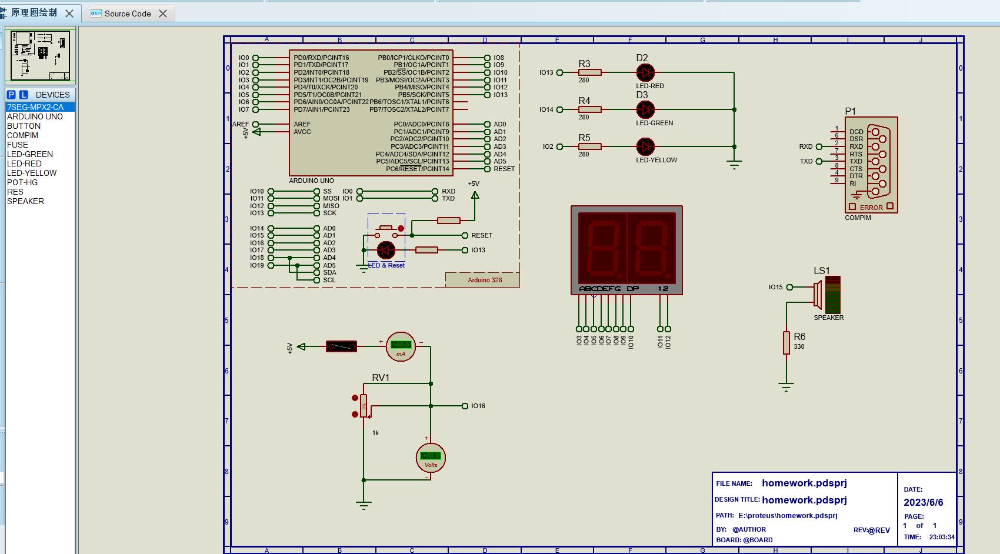
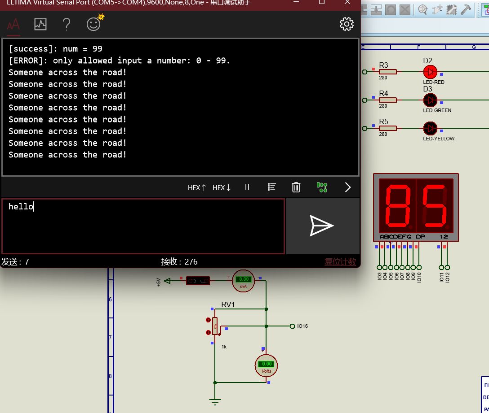

<!-- TOC -->
* [作业内容](#作业内容)
* [已知问题](#已知问题)
* [项目结构](#项目结构)
  * [源码](#源码)
  * [protues项目文件](#protues项目文件)
* [图片](#图片)
  * [元件布局](#元件布局)
  * [模拟结果](#模拟结果)
<!-- TOC -->

# 作业内容

采用数码管，红黄绿三个二极管完成交通灯控制，数码管显示当前交通灯所剩时间，每一秒数值减少，红灯20秒，黄灯10s，绿灯15s。
采用物联网通讯，远程可以修改数码管的显示值。当绿灯亮时，开启喇叭督促行人快速通过。运用保险丝电路来代替行人闯灯提示
（一旦保险丝短，向上位机发送英文“someone across the road”）

# 已知问题

1. 倒计时时间不是严格的1秒

# 项目结构

## 源码

`src/main.cpp`

| 注意: IO引脚设置请修改代码开头的宏定义, 初始化引脚, 请注意setup()函数的引脚初始化

## proteus项目文件

`proteus_workspace/homework.pdsprj`

# 图片

## 元件布局

## 模拟结果

